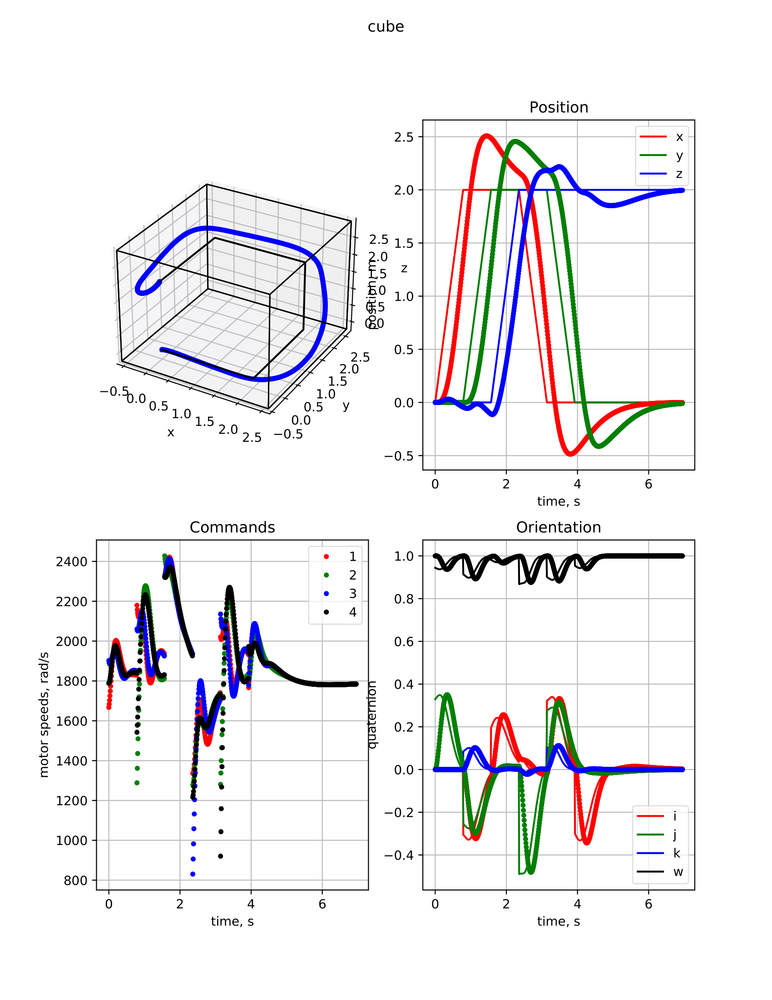

## Implementation of control, planning, vision and state estimation algorithms for CrazyFile 2.0 quadrotor

### Geometric Nonlinear Controller:
Reference: [Geometric Tracking Control of a Quadrotor UAV on SE(3)](https://mathweb.ucsd.edu/~mleok/pdf/LeLeMc2010_quadrotor.pdf)

